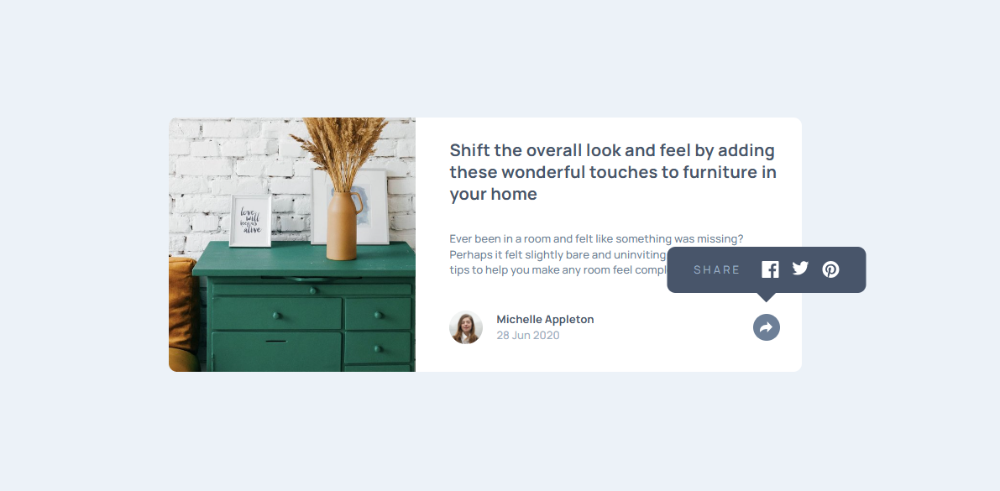
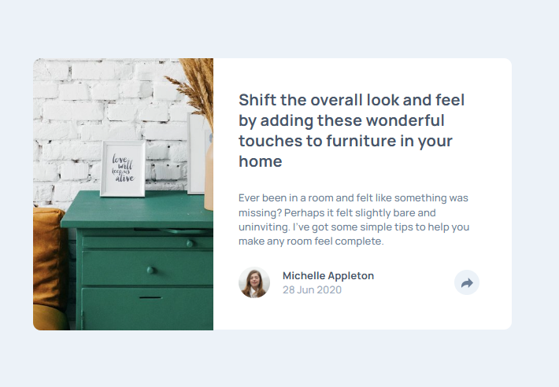
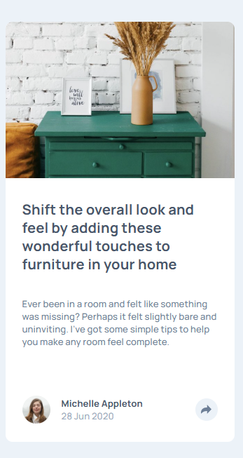
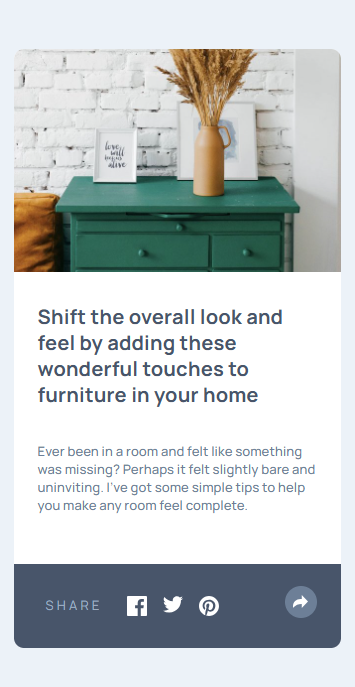

# Frontend Mentor - Article preview component solution

This is a solution to the [Article preview component challenge on Frontend Mentor](https://www.frontendmentor.io/challenges/article-preview-component-dYBN_pYFT). Frontend Mentor challenges help you improve your coding skills by building realistic projects. 

## Table of contents

- [Overview](#overview)
  - [The challenge](#the-challenge)
  - [Screenshots](#screenshots)
- [My process](#my-process)
  - [Built with](#built-with)
  - [What I learned](#what-i-learned)
- [Author](#author)

## Overview

### The challenge

Users should be able to:

- View the optimal layout for the component depending on their device's screen size
- See the social media share links when they click the share icon

### Screenshots

#### Desktop (active)

#### Tablet

#### Mobile 

 

## My process

### Built with

- Semantic HTML5 markup
- CSS custom properties
- Flexbox
- CSS Grid
- Mobile-first workflow
- JavaScript

### What I learned

Th JS was very straightforward and unchallenging, but i got to practice positioning ablsolute a lot, which was very helpful

## Author

- Website - [jonatan samuelsson](https://jontesamuelsson.se)
- Frontend Mentor - [@jonatan-samuelsson](https://www.frontendmentor.io/profile/jonatan-samuelsson)

