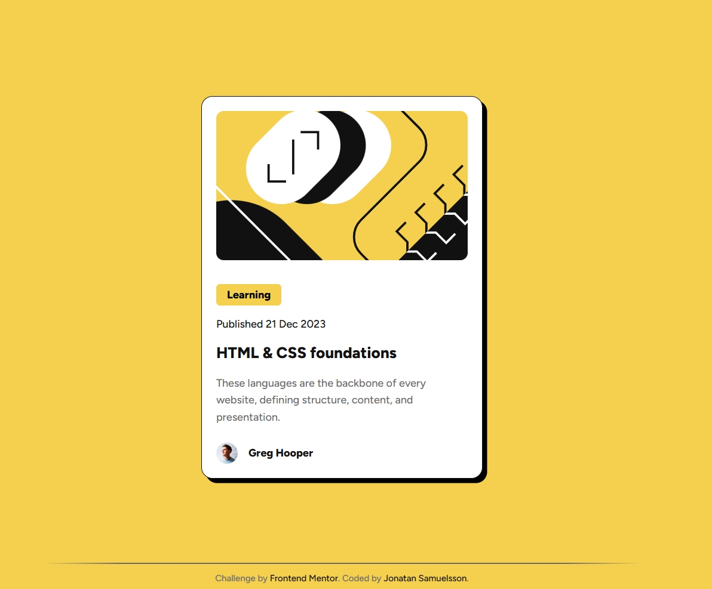

# Frontend Mentor - Blog preview card solution

This is a solution to the [Blog preview card challenge on Frontend Mentor](https://www.frontendmentor.io/challenges/blog-preview-card-ckPaj01IcS). Frontend Mentor challenges help you improve your coding skills by building realistic projects. 

## Table of contents

- [Overview](#overview)
  - [The challenge](#the-challenge)
  - [Screenshot](#screenshot)
 
- [My process](#my-process)
  - [Built with](#built-with)
  - [What I learned](#what-i-learned)
  - [Continued development](#continued-development)
  - [Useful resources](#useful-resources)
- [Author](#author)

## Overview

### The challenge

Users should be able to:

- See hover and focus states for all interactive elements on the page

### Screenshot

## My process

### Built with

- Semantic HTML5 markup
- CSS custom properties
- Flexbox
- Mobile-first workflow

### What I learned

Combining clamp width and object-fit made the image cropping work

### Continued development

Still haven't figured out a consistent way of dealing with padding and margins. I try to use only, say top or bottom margins throughout, but then I run into adding both, or just padding anyway.

### Useful resources

- [Object-fit property](https://www.digitalocean.com/community/tutorials/css-cropping-images-object-fit) - This helped me get the image to crop correctly when resizing

## Author

- Website - [Jonatan Samuelsson](https://jontesamuelsson.se)
- Frontend Mentor - [@yourusername](https://www.frontendmentor.io/profile/jonatan-samuelsson)

