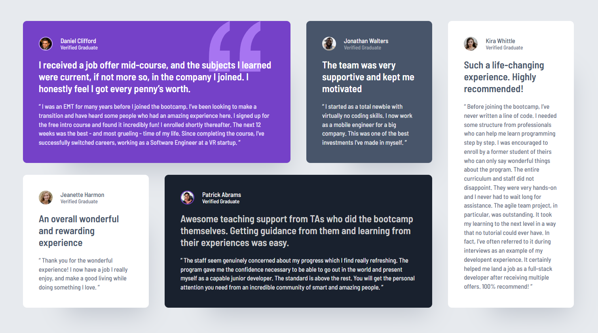
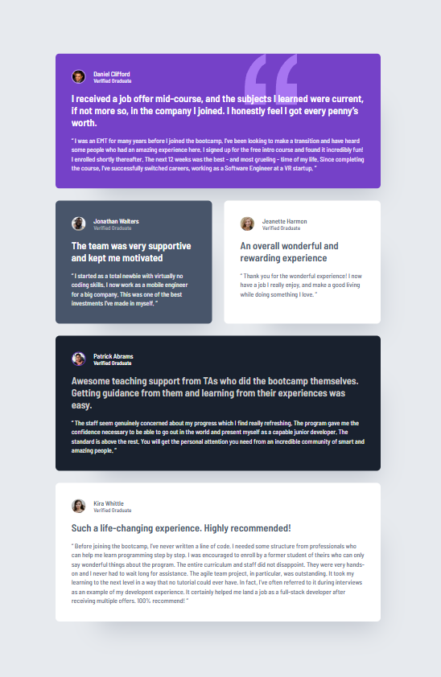
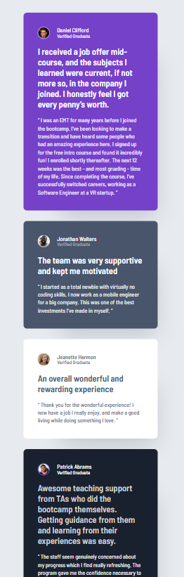

# Frontend Mentor - Testimonials grid section solution

This is a solution to the [Testimonials grid section challenge on Frontend Mentor](https://www.frontendmentor.io/challenges/testimonials-grid-section-Nnw6J7Un7). Frontend Mentor challenges help you improve your coding skills by building realistic projects. 

## Table of contents

- [Overview](#overview)
  - [The challenge](#the-challenge)
  - [Screenshots](#screenshots)
- [My process](#my-process)
  - [Built with](#built-with)
  - [What I learned](#what-i-learned)
- [Author](#author)

**Note: Delete this note and update the table of contents based on what sections you keep.**

## Overview

### The challenge

Users should be able to:

- View the optimal layout for the site depending on their device's screen size

### Screenshots

##Desktop

##Tablet

##Mobile

## My process

### Built with

- Semantic HTML5 markup
- CSS custom properties
- Flexbox
- CSS Grid
- Mobile-first workflow
- [Sass](https://sass-lang.com/) - CSS preprocessor

### What I learned

This really helped me get more comfortable with grid-areas. I also got more into the figma file this time, extracting more and better design info which helped a lot.

## Author

- Website - [Jonatan Samuelsson](https://jontesamuelsson.se)
- Frontend Mentor - [@jonatan-samuelsson](https://www.frontendmentor.io/profile/jonatan-samuelsson)

