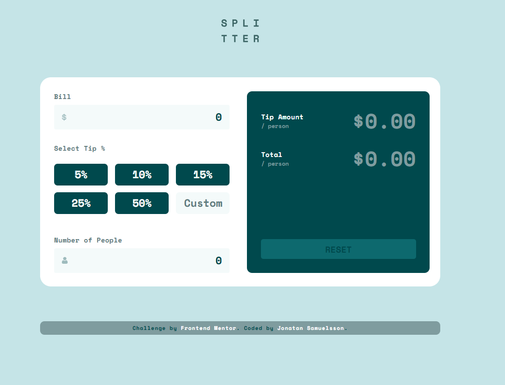
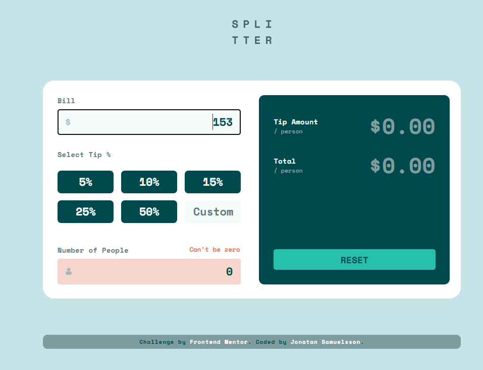
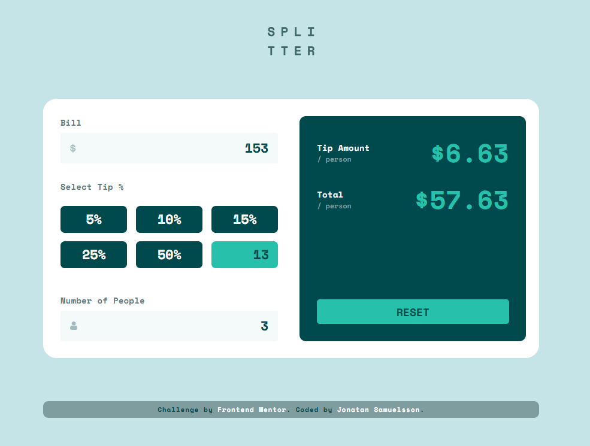
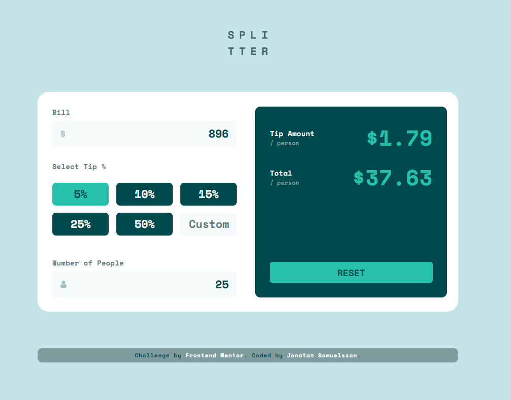

# Frontend Mentor - Tip calculator app solution

This is a solution to the [Tip calculator app challenge on Frontend Mentor](https://www.frontendmentor.io/challenges/tip-calculator-app-ugJNGbJUX). Frontend Mentor challenges help you improve your coding skills by building realistic projects.

## Table of contents

- [Overview](#overview)
  - [The challenge](#the-challenge)
  - [Screenshots](#screenshots)
- [My process](#my-process)
  - [Built with](#built-with)
  - [What I learned](#what-i-learned)
  - [Continued development](#continued-development)

- [Author](#author)
- [Acknowledgments](#acknowledgments)

## Overview

### The challenge

Users should be able to:

- View the optimal layout for the app depending on their device's screen size
- See hover states for all interactive elements on the page
- Calculate the correct tip and total cost of the bill per person

### Screenshots

## My process

### Built with

- Semantic HTML5 markup
- CSS custom properties
- Flexbox
- CSS Grid
- Mobile-first workflow
- JavaScript

### What I learned

I tried to keep the javaScript clean and DRY, but I don't think I succeeded that well. It does the job but it isn't very pretty. 

Otherwise my biggest challenge on this one had to do with inputs, which kept mucking up the container widths. I ended up using divs with `contenteditable=true` instead, which worked great for layout purpuses, but on the flip side made the JS a lot more complicated. 

I used ChatGPT a few times on this one, but never to write actual code, only for debugging and troubleshooting. 

### Continued development

I need more work on eventhandlers, JS objects/arrays/HTMLCollections and so forth. It all still becomes a jungle in my head.

## Author

- Website - [Jonatan Samuelsson](https://www.jontesamuelsson.se)
- Frontend Mentor - [@jonatan-samuelsson](https://www.frontendmentor.io/profile/jonatan-samuelsson)

## Acknowledgments

Chat GPT helped med understand when my JS wasn't working
